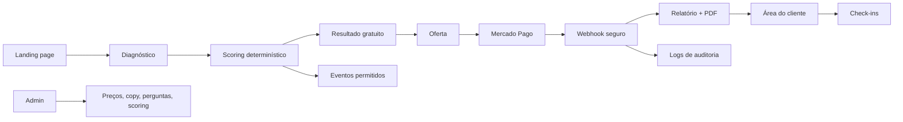

# Arquitetura

O frontend usa Next.js App Router. A lógica crítica fica no backend ou em módulos compartilhados testáveis. Em modo demo,
persistência e pagamento são simulados para validar a jornada sem segredos.
