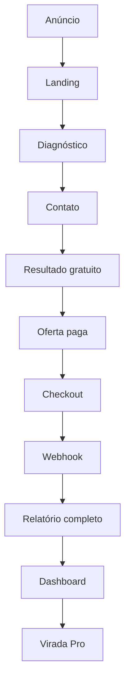

# Produto

O Virada IA ajuda o usuário a descobrir qual área mais trava seu progresso e qual mudança deve vir primeiro.

Não vende milagre, cura, enriquecimento rápido ou transformação garantida. A venda é clareza, direção, prioridade,
sensação de controle e um plano executável.

Funil:

